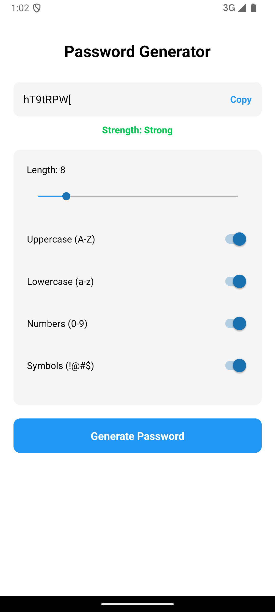

# Password Generator App

A modern and secure password generator built with React Native and Expo. Generate strong passwords with customizable options and a clean, intuitive interface.



## Features

- 🔐 Generate secure random passwords
- 📏 Adjustable password length (4-32 characters)
- ⚙️ Customizable character options:
  - Uppercase letters (A-Z)
  - Lowercase letters (a-z)
  - Numbers (0-9)
  - Special symbols (!@#$%^&*()_+-=[]{}|;:,.<>?)
- 💪 Password strength indicator
- 📋 One-tap copy to clipboard
- 📱 Cross-platform support (iOS & Android)
- 🎨 Modern and clean UI/UX

## Installation

1. Clone the repository:
```bash
git clone https://github.com/Pmvita/Password_Gen-v2.git
```

2. Install dependencies:
```bash
cd Password_Gen-v2
yarn install
```

3. Install the required Slider component:
```bash
yarn add @react-native-community/slider
```

4. Start the development server:
```bash
yarn start
```

## Usage

1. Adjust the password length using the slider
2. Toggle character types using the switches:
   - Uppercase letters
   - Lowercase letters
   - Numbers
   - Symbols
3. Tap "Generate Password" to create a new password
4. Tap "Copy" to copy the password to clipboard
5. Check the strength indicator to ensure your password meets your security requirements

## Technical Details

- Built with React Native and Expo
- Written in TypeScript
- Uses native platform notifications
- Implements secure random password generation
- Responsive design that works on all screen sizes

## Contributing

1. Fork the repository
2. Create your feature branch (`git checkout -b feature/AmazingFeature`)
3. Commit your changes (`git commit -m 'Add some AmazingFeature'`)
4. Push to the branch (`git push origin feature/AmazingFeature`)
5. Open a Pull Request

## License

This project is licensed under the MIT License - see the LICENSE file for details.

## Screenshots

To add screenshots:
1. Create an `assets` folder in your project root
2. Take screenshots of your app
3. Add them to the assets folder
4. Update the image path in this README

## Todo

- [ ] Add password history
- [ ] Implement password saving functionality
- [ ] Add password requirements presets
- [ ] Include password generation patterns
- [ ] Add dark mode support

## Contact

Pierre Mvita - [LinkedIn](https://www.linkedin.com/in/pierre-mvita/)

Project Link: [Password_Gen-v2](https://github.com/Pmvita/Password_Gen-v2.git)